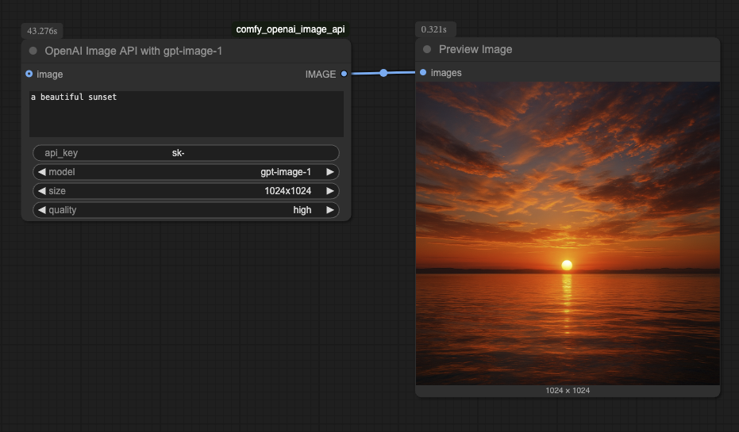
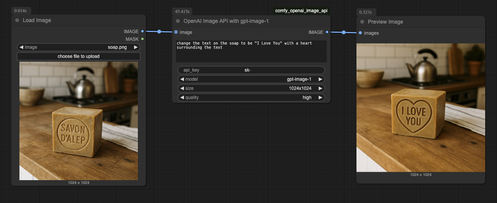
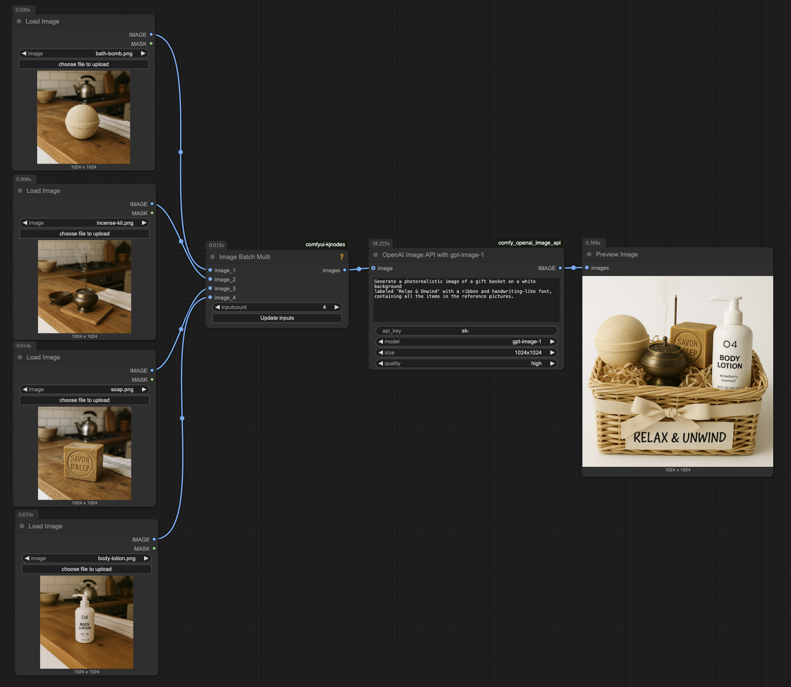

# ComfyUI OpenAI Image API

A ComfyUI node that provides access to OpenAI's image generation and editing capabilities, including support for **gpt-image-1** model with both **OpenAI** and **Azure OpenAI** providers.

## 📋 Project Origin

This project is based on the original work from [unicough/comfy_openai_image_api](https://github.com/unicough/comfy_openai_image_api). 

**Key Enhancements:**
- ✅ Added Azure OpenAI support
- ✅ Added flexible configuration options (environment variables + node parameters)
- ✅ Enhanced error handling and security
- ✅ Comprehensive documentation and examples

## Features

- **Image Generation**: Create images from text prompts using gpt-image-1
- **Image Editing**: Edit existing images with text prompts
- **Multiple Providers**: Support for both OpenAI and Azure OpenAI
- **Quality Control**: Low, medium, and high quality options
- **Size Options**: 1024x1024, 1536x1024, 1024x1536
- **Batch Processing**: Handle multiple images at once
- **Environment Variables**: Secure credential management

- Prompt only with no input image:


- One image input:


- Multiple images input:


> [!NOTE]
> This projected was created with a [cookiecutter](https://github.com/Comfy-Org/cookiecutter-comfy-extension) template. It helps you start writing custom nodes without worrying about the Python setup.

## Installation

1. Clone this repository into your ComfyUI custom nodes directory:
```bash
cd ComfyUI/custom_nodes
git clone https://github.com/your-username/comfy_openai_image_api.git
```

2. Install the required dependencies:
```bash
cd comfy_openai_image_api
pip install -r requirements.txt
```

3. Restart ComfyUI

## Configuration

### Environment Variables (Recommended)

Create a `.env` file in the project root (copy from `.env.example`):

```env
# OpenAI Configuration
OPENAI_API_KEY=your_openai_api_key_here

# Azure OpenAI Configuration
AZURE_OPENAI_ENDPOINT=https://your-resource-name.openai.azure.com/
AZURE_OPENAI_API_KEY=your_azure_openai_api_key_here
AZURE_OPENAI_API_VERSION=2024-12-01-preview
AZURE_OPENAI_DEPLOYMENT=gpt-image-1
```

### Node Parameters

The node accepts the following parameters:

#### Required Parameters:
- **prompt**: Text description of the image you want to generate or edit
- **model**: Currently supports "gpt-image-1"
- **size**: Image dimensions (1024x1024, 1536x1024, 1024x1536)
- **quality**: Image quality (low, medium, high)
- **provider**: Choose between "openai" or "azure"

#### Optional Parameters:
- **image**: Input image for editing (optional, for generation leave empty)
- **api_key**: API key (can be provided here or via environment variable)
- **azure_endpoint**: Azure OpenAI endpoint URL (for Azure provider)
- **azure_api_version**: Azure OpenAI API version (default: 2024-12-01-preview)
- **azure_deployment**: Azure OpenAI deployment name (default: gpt-image-1)

## Usage

### OpenAI Provider

1. Set your OpenAI API key in the environment variable `OPENAI_API_KEY` or provide it in the node
2. Select "openai" as the provider
3. Configure your prompt and other parameters
4. Run the node

### Azure OpenAI Provider

1. Set up your Azure OpenAI resource and deploy the gpt-image-1 model
2. Configure environment variables or provide parameters directly:
   - `AZURE_OPENAI_ENDPOINT`
   - `AZURE_OPENAI_API_KEY`
   - `AZURE_OPENAI_DEPLOYMENT`
3. Select "azure" as the provider
4. Configure your prompt and other parameters
5. Run the node

### Image Generation

Connect the node without any input image to generate new images from text prompts.

### Image Editing

Connect an existing image to the image input to edit/modify the image based on your text prompt.

## Examples

### Basic Image Generation
```
Provider: openai
Prompt: "A beautiful landscape with mountains and lakes"
Model: gpt-image-1
Size: 1024x1024
Quality: high
```

### Image Editing with Azure OpenAI
```
Provider: azure
Prompt: "Add a sunset sky to this image"
Model: gpt-image-1
Size: 1024x1024
Quality: medium
Image: [Connected input image]
Azure Endpoint: https://your-resource.openai.azure.com/
Azure Deployment: gpt-image-1
```

## Error Handling

The node includes comprehensive error handling for:
- Missing or invalid API keys
- Network connectivity issues
- Invalid image formats
- API rate limiting
- Service unavailability

All errors are displayed in the ComfyUI console with detailed messages.

## Security Best Practices

- Use environment variables for API keys
- Never commit API keys to version control
- Use Azure Managed Identity when possible
- Regularly rotate API keys
- Monitor API usage and costs

## Requirements

- Python 3.8+
- ComfyUI
- OpenAI Python library
- torch
- PIL (Pillow)
- numpy

## Quickstart

1. Install [ComfyUI](https://docs.comfy.org/get_started).
1. Install [ComfyUI-Manager](https://github.com/ltdrdata/ComfyUI-Manager)
1. Look up this extension in ComfyUI-Manager. If you are installing manually, clone this repository under `ComfyUI/custom_nodes`.
1. Restart ComfyUI.

# Features

- A list of features

## Develop

To install the dev dependencies and pre-commit (will run the ruff hook), do:

```bash
cd openai_image_api
pip install -e .[dev]
pre-commit install
```

The `-e` flag above will result in a "live" install, in the sense that any changes you make to your node extension will automatically be picked up the next time you run ComfyUI.

## Publish to Github

Install Github Desktop or follow these [instructions](https://docs.github.com/en/authentication/connecting-to-github-with-ssh/generating-a-new-ssh-key-and-adding-it-to-the-ssh-agent) for ssh.

1. Create a Github repository that matches the directory name. 
2. Push the files to Git
```
git add .
git commit -m "project scaffolding"
git push
``` 

## Writing custom nodes

An example custom node is located in [node.py](src/openai_image_api/nodes.py). To learn more, read the [docs](https://docs.comfy.org/essentials/custom_node_overview).


## Tests

This repo contains unit tests written in Pytest in the `tests/` directory. It is recommended to unit test your custom node.

- [build-pipeline.yml](.github/workflows/build-pipeline.yml) will run pytest and linter on any open PRs
- [validate.yml](.github/workflows/validate.yml) will run [node-diff](https://github.com/Comfy-Org/node-diff) to check for breaking changes

## Publishing to Registry

If you wish to share this custom node with others in the community, you can publish it to the registry. We've already auto-populated some fields in `pyproject.toml` under `tool.comfy`, but please double-check that they are correct.

You need to make an account on https://registry.comfy.org and create an API key token.

- [ ] Go to the [registry](https://registry.comfy.org). Login and create a publisher id (everything after the `@` sign on your registry profile). 
- [ ] Add the publisher id into the pyproject.toml file.
- [ ] Create an api key on the Registry for publishing from Github. [Instructions](https://docs.comfy.org/registry/publishing#create-an-api-key-for-publishing).
- [ ] Add it to your Github Repository Secrets as `REGISTRY_ACCESS_TOKEN`.

A Github action will run on every git push. You can also run the Github action manually. Full instructions [here](https://docs.comfy.org/registry/publishing). Join our [discord](https://discord.com/invite/comfyorg) if you have any questions!

